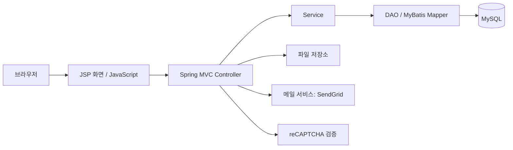
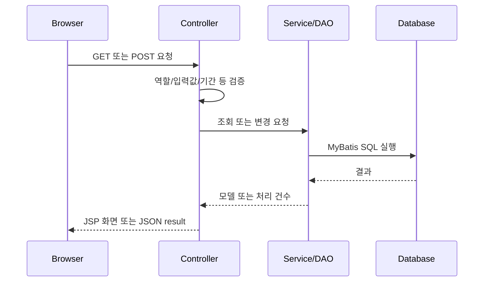

# 1. 시스템 아키텍처 및 공통 기능

## 1.1 목적

KSEE 웹사이트는 학회 정보와 학술대회를 외부에 제공하고, 회원·게시판·참가신청·관리자 운영을 하나의 서버 애플리케이션에서 처리한다.

## 1.2 논리 구성

| 계층 | 책임 | 대표 구성 |
|---|---|---|
| 화면 | JSP 렌더링, 폼 입력, AJAX 요청 | `WEB-INF/views`, `resources/js` |
| 웹 | URL 매핑, 화면 모델 구성, 요청 응답 | `www.ksee.kr.web` |
| 서비스/DAO | 업무 처리와 MyBatis 호출 | `service`, `dao`, `mapper` |
| 저장 | 관계형 데이터·업로드 파일 | MySQL, 서버 파일 경로 |

## 1.3 역할 및 접근 기준

| 역할 | 가능한 기능 |
|---|---|
| 비회원 | 공개 페이지, 행사/게시물 조회, 검색, 회원가입, 로그인, 참가신청 화면 |
| 로그인 회원 | 내 정보 관리, 일부 게시판 작성, 게시글 본인 수정 화면, 댓글 작성 |
| 관리자 | `/admin/**`의 회원·행사·신청·팝업·소개 페이지 관리 |

로그인 처리는 `/member/loginProcess`를 Spring Security form login으로 수행한다. 로그아웃 URL은 `/j_spring_security_logout`이며 세션 쿠키(`JSESSIONID`)를 제거한다.

## 1.4 공통 처리 흐름

## 1.5 공통 데이터 연결 규칙

- 게시글·행사 상세·참가신청은 업로드된 파일/이미지의 식별자를 저장하여 연결한다.
- 업로드 시 먼저 파일 메타데이터를 생성하고, 이후 게시글/콘텐츠 저장 시 대상 식별자로 연결한다.
- 소개 페이지는 `page_key`별로 HTML 또는 파일 표시 방식 중 하나를 저장한다.
- 목록 페이지는 `Paging` 값을 사용해 조회한다.

