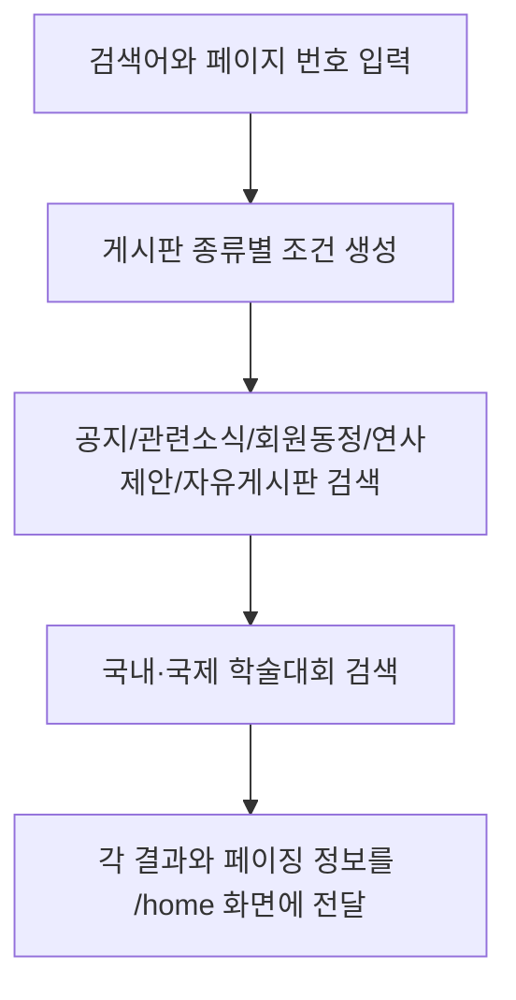

# 2. 공개 콘텐츠 및 검색

## 2.1 기능 설명

비회원도 학회 소개, 홈 화면, 학술대회와 게시판 정보를 조회할 수 있다. 홈 화면은 날짜와 현재 언어에 맞는 팝업 및 최신 게시글을 구성한다. 데스크톱에서는 팝업·공지사항과 관련소식·자유게시판을 명시적인 2열 Grid로 배치하고, 모바일에서는 1열로 전환한다.

| 기능 | URL | 설명 |
|---|---|---|
| 메인 | `GET /` | 노출 기간/언어가 맞는 팝업, 공지·자유게시판·관련소식 목록 표시 |
| 통합 검색 | `GET /search` | 5종 게시판과 국내/국제 학술대회를 검색 |
| 소개 | `GET /about/greet`, `/history`, `/term`, `/member` | 인사말·연혁·정관·임원진 표시 |
| 정적 안내 | `GET /company`, `/information`, `/notice`, `/picture`, `/links` | 안내용 JSP 화면 표시 |
| 약관 | `GET /term/privacy`, `/term/email` | 개인정보·이메일 관련 약관 표시 |

## 2.2 소개 페이지 표시 명세

| 항목 | 값 |
|---|---|
| 페이지 키 | `greet`, `history`, `term`, `member` |
| 저장 데이터 | 표시 형식(`HTML`/`FILE`), HTML 콘텐츠 또는 파일 ID/유형, 수정자·수정일 |
| 조회 동작 | DB 콘텐츠를 화면 모델 `pageContent`로 전달 |
| 폴백 | DB 콘텐츠가 없으면 JSP에 남아 있는 기존 소개 내용을 사용 |

## 2.3 통합 검색 순서도

## 2.4 입력·출력 명세

| 기능 | 주요 입력 | 처리 규칙 | 출력 |
|---|---|---|---|
| 메인 | 현재 날짜, 로케일 | 날짜·언어 조건으로 팝업 조회; 게시판별 목록 조회; 게시글 요약은 HTML을 제거한 평문으로 출력 | `index.jsp` |
| 통합 검색 | `query`, `pageNo` | 게시판 5개 유형과 행사 2개 유형을 각각 조회 | `/home.jsp` |
| 소개 페이지 | 페이지 키 | 키별 콘텐츠 조회, 없으면 JSP 폴백 | 소개 JSP |
