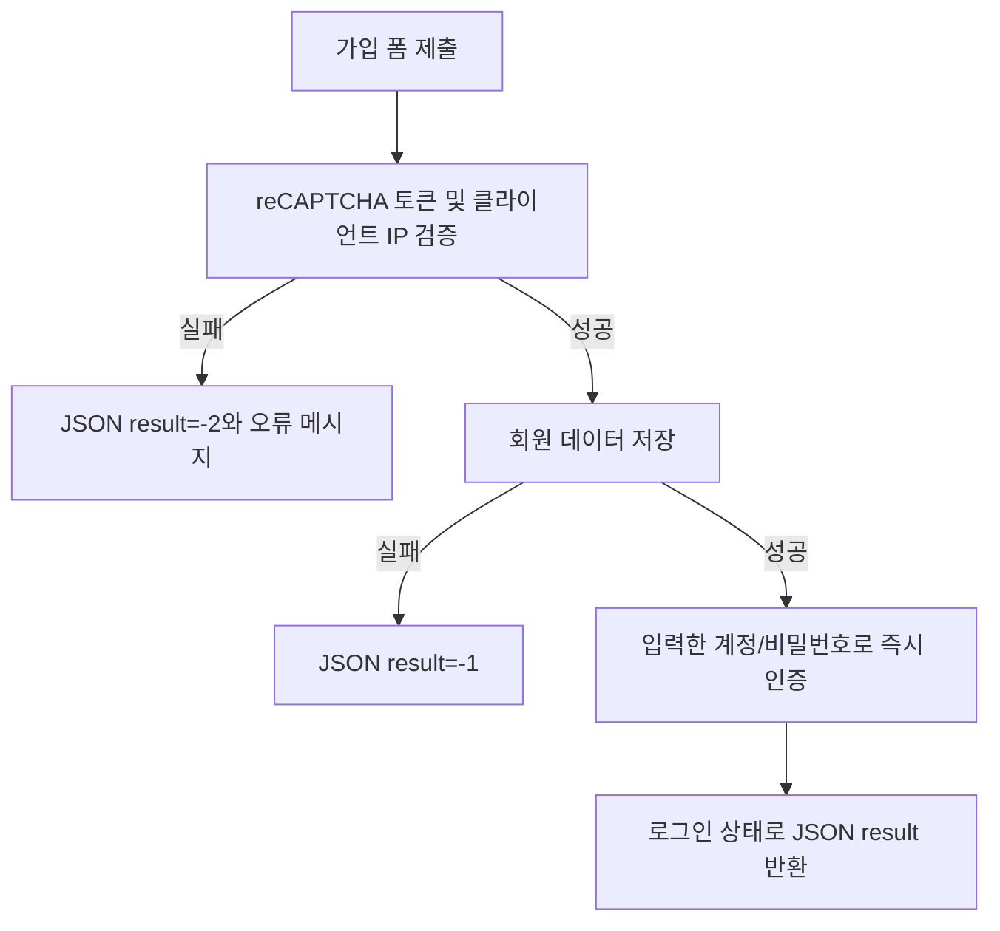
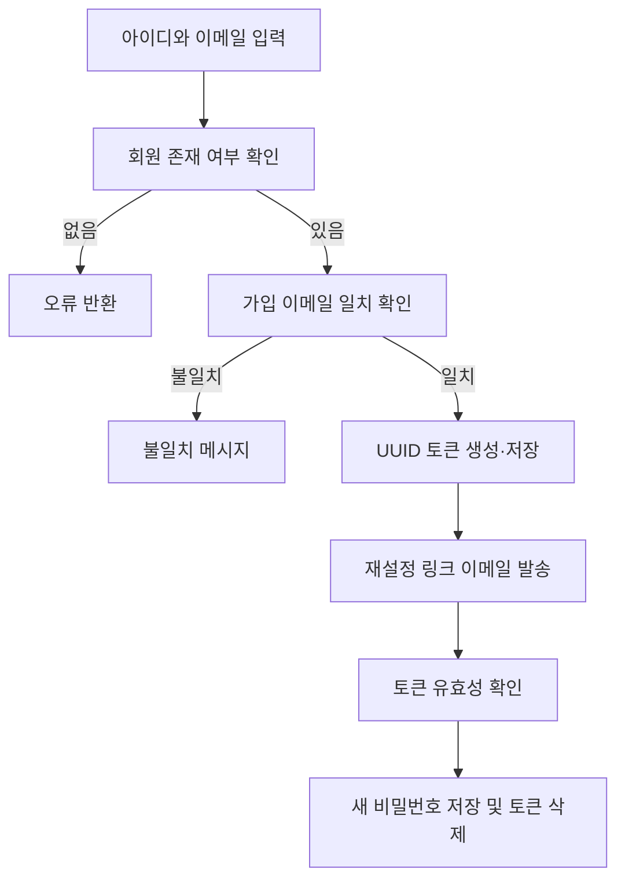

# 3. 회원 및 인증

## 3.1 기능 설명

회원 기능은 가입, 로그인, 계정 찾기, 이메일 기반 비밀번호 재설정, 내 정보 변경, 탈퇴를 제공한다.

| 기능 | 접근 | 주요 URL |
|---|---|---|
| 로그인/로그아웃 | 비회원/로그인 회원 | `/member/login`, `/member/loginProcess`, `/j_spring_security_logout` |
| 회원가입 | 비회원 | `GET/POST /member/signup` |
| 아이디 중복 확인 | 비회원 | `GET /member/get` |
| 아이디 찾기 | 비회원 | `GET/POST /member/findId` |
| 비밀번호 재설정 | 비회원 또는 로그인 회원 | `/member/findPwd`, `/member/findPwd/submit`, `/member/validate/token`, `/member/newPwd` |
| 내 정보/탈퇴 | 로그인 회원 | `/member/myinfo`, `/member/edit`, `/member/delete` |

## 3.2 회원가입 순서도

## 3.3 비밀번호 재설정 순서도

## 3.4 기능명세

| 기능 | 주요 입력 | 검증/업무 규칙 | 결과 |
|---|---|---|---|
| 가입 | 회원 정보, `g-recaptcha-response` | reCAPTCHA가 유효해야 하며 ID 유효성/중복 여부를 별도 확인 가능 | 회원 저장 후 자동 로그인 |
| 로그인 | `loginid`, `loginpwd` | Spring Security 인증 제공자 사용 | 성공/실패 핸들러가 후속 처리 |
| 아이디 찾기 | 사용자 식별 정보 | 조건에 맞는 회원을 찾음 | 로그인 ID 또는 없음 결과 |
| 비밀번호 찾기 | 회원 정보, 이메일 | 저장된 이메일과 입력 이메일이 일치해야 함 | 이메일 토큰 생성 및 링크 발송 |
| 새 비밀번호 | 비밀번호, 선택적 `userId` | 토큰 경로 또는 로그인 상태에서만 변경 | 사용자 정보 갱신 |
| 정보 수정 | 회원 정보 | 로그인 회원의 수정 화면 제공 | JSON 처리 결과 |
| 탈퇴 | 현재 비밀번호 | 현재 사용자 비밀번호 일치 필요 | 회원 삭제 후 로그아웃 URL 반환 |

## 3.5 상태 확인 API

- `GET /member/isLogin`: 로그인 여부를 JSON `result`로 반환한다.
- `GET /member/isAdmin`: 관리자 역할 여부를 JSON `result`로 반환한다.

