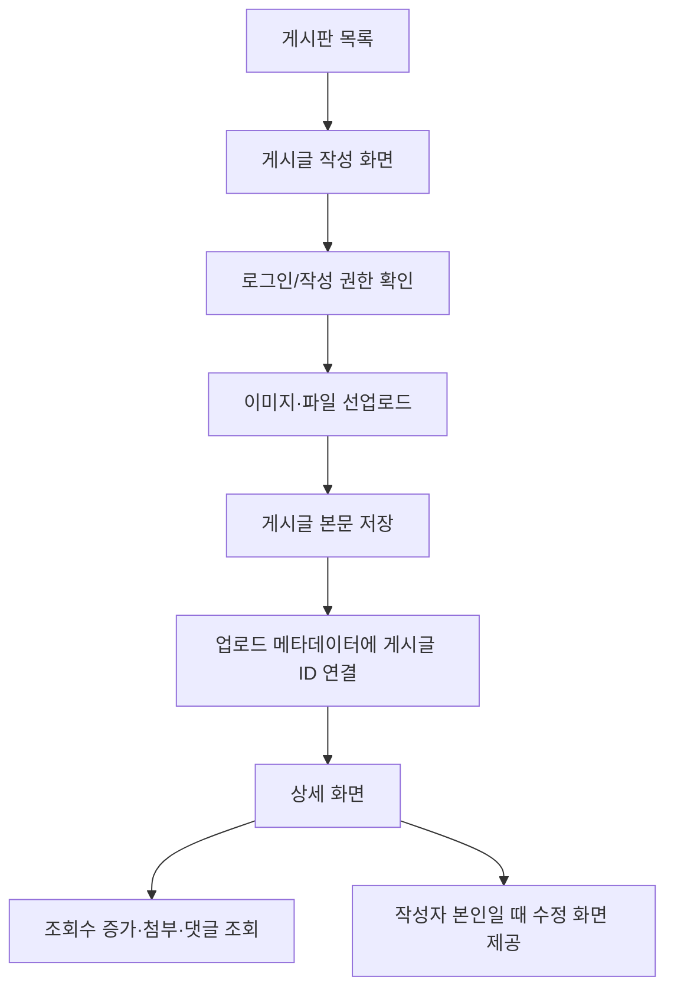

# 5. 게시판 및 댓글

## 5.1 기능 설명

공통 게시글 모델을 이용해 다섯 개 게시판을 운영한다. 게시글에는 본문, 첨부파일, 이미지, 댓글을 연결할 수 있다.

| 게시판 | 경로 키 | 작성 권한 확인 방식 |
|---|---|---|
| 공지사항 | `notice` | 관리자 여부 |
| 관련소식 | `news` | 로그인 여부 |
| 회원동정 | `member` | 로그인 여부 |
| 연사제안 | `speaker` | 로그인 여부 |
| 자유게시판 | `free` | 로그인 여부 |

## 5.2 게시글 처리 순서도

## 5.3 기능명세

| 기능 | URL | 주요 처리 | 반환 |
|---|---|---|---|
| 목록 | `GET /group/{name}` | 게시판 유형·언어·검색/페이징 조건으로 목록 조회 | 게시판 목록 JSP |
| 상세 | `GET /group/{name}/view/{id}` | 조회수 증가, 첨부파일·이미지·댓글 조회 | 상세 JSP |
| 작성 화면 | `GET /group/{name}/write` | 게시판 정보와 로그인 사용자 전달 | 작성 JSP |
| 저장 | `POST /board/insertBoard` | 로그인 사용자를 작성자로 저장, 파일/사진 연결 | JSON `result` |
| 수정 화면 | `GET /group/{name}/edit/{id}` | 로그인 및 작성자 일치 여부 확인 | 수정 JSP 또는 로그인 이동 |
| 수정 | `POST /board/editBoard` | 게시글 갱신, 파일/사진 재연결 | JSON `result` |
| 삭제 | `GET/POST /board/delete/{id}` | 게시글 삭제 후 연결 파일의 실제 파일 삭제 시도 | JSON `result` |
| 댓글 생성/수정/삭제 | `POST /reply/insert|update|delete` | 생성 시 로그인 사용자 ID를 작성자로 설정 | JSON `result` |

## 5.4 게시글 데이터

- 게시글: 게시판 유형, 제목, HTML 본문, 작성자 ID, 언어, 조회수, 등록/수정 정보
- 연결 리소스: 일반 첨부파일 목록과 이미지 목록
- 댓글: 게시글 ID, 작성자 ID, 내용, 등록/수정 정보

