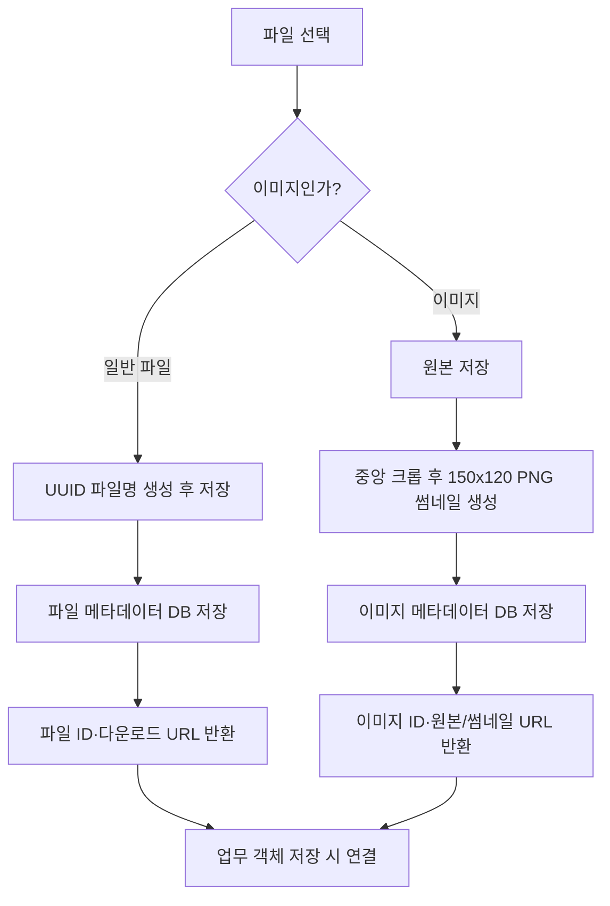

# 6. 파일 및 이미지 관리

## 6.1 기능 설명

파일/이미지를 먼저 서버에 업로드하여 메타데이터 ID를 받고, 이후 게시글·행사 상세·참가신청·메일·팝업에서 해당 ID를 참조한다.

| 기능 | URL | 설명 |
|---|---|---|
| 일반 파일 업로드 | `GET/POST /upload/file` | UUID 기반 새 파일명으로 저장, 파일 메타데이터 생성 |
| 이미지 업로드 | `GET/POST /upload/image` | 원본 저장 후 150×120 중앙 크롭 썸네일 생성 |
| 원본 이미지 표시 | `GET /picture/{id}` | 이미지 메타데이터로 원본 파일 스트리밍 |
| 썸네일 표시 | `GET /thumbnail/{id}` | 썸네일 파일 스트리밍 |
| 파일 다운로드 | `GET /upload/get/{id}` | 다운로드 헤더와 원래 파일명으로 파일 제공 |
| 파일 삭제 | `POST /delete/{img|file}/{id}` | 메타데이터 삭제 및 원본 파일 삭제 시도 |

## 6.2 업로드 순서도

## 6.3 메타데이터 명세

| 유형 | 저장 정보 |
|---|---|
| 일반 파일 | 원본명, UUID 기반 저장명, 크기, MIME 유형, 업로더, 연결 대상 ID |
| 이미지 | 일반 파일 정보, 썸네일 파일명, 썸네일 크기, 원본/썸네일 URL |

## 6.4 연계 대상

- 게시글: 일반 파일과 이미지
- 행사 상세: 이미지
- 참가신청: 일반 파일
- 관리자 메일: 첨부파일
- 팝업: 국문/영문 이미지

