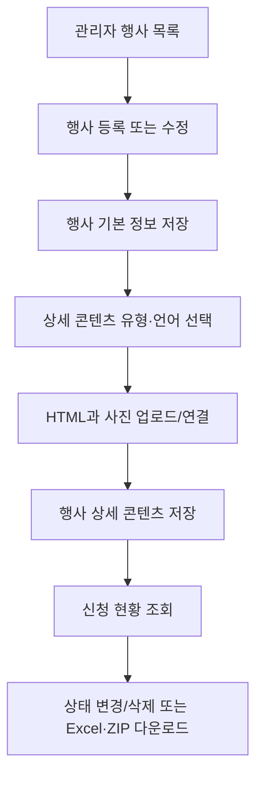

# 7. 관리자 운영 기능

## 7.1 기능 설명

관리자 메뉴는 회원, 국내/국제 학술대회, 참가신청, 팝업, 소개 페이지 콘텐츠를 운영한다. `/admin/**` 경로는 관리자 역할이 요구된다.

| 영역 | 주요 기능 |
|---|---|
| 회원 관리 | 목록/검색, 상세, 수정, 삭제, 전체 Excel 다운로드, 대상 회원 메일 작성 |
| 행사 관리 | 국내·국제 행사 목록, 등록·수정·삭제, 상세 탭별/언어별 콘텐츠 편집 |
| 신청 관리 | 행사별 신청자 조회/검색, 상태 일괄 변경 또는 삭제, 첨부 ZIP, 신청자 Excel |
| 팝업 관리 | 목록, 등록, 수정, 삭제, 노출 순서 변경, 국문/영문 이미지 리사이즈 |
| 페이지 관리 | 인사말·임원진·정관·연혁을 HTML 또는 파일로 저장 |

## 7.2 행사 운영 순서도

## 7.3 관리자 기능명세

| 기능 | 주요 URL | 입력/규칙 | 산출 |
|---|---|---|---|
| 회원 목록 | `GET /admin/members/` | 검색·페이징 | 회원 목록 |
| 회원 Excel | `GET /admin/members/download/excel` | 전체 회원 조회 | `.xls` |
| 회원 메일 | `GET/POST /admin/members/mail/write` | 수신 회원 ID, 발신자, 제목, 내용, 첨부파일 ID | SendGrid 다중 메일 발송 결과 |
| 행사 CRUD | `/admin/{domestic|international}/`, `/write`, `/symposium/update/{id}`, `/symposium/delete/{id}` | 행사 기본 필드, 행사 유형은 URL로 결정 | 행사 목록/JSON 결과 |
| 행사 상세 콘텐츠 | `/admin/{where}/write/content/...` | 상세 유형, 언어, HTML, 사진 ID | 상세 콘텐츠 저장 |
| 신청 현황 | `GET /admin/apply/list/{sympId}` | 행사 ID, 선택 검색어 | 신청 목록 |
| 신청 상태 | `POST /admin/apply/change` | 신청 ID 배열, 상태; 상태 3은 삭제 | JSON 결과 |
| 신청 자료 ZIP | `GET /admin/apply/list/{sympId}/download` | 행사에 연결된 신청 첨부파일 | ZIP 다운로드 |
| 신청자 Excel | `GET /admin/apply/list/{sympId}/excel` | 행사별 신청 데이터 | `.xls` |
| 팝업 | `/admin/popup/*` | 팝업 정보, 국문/영문 이미지 ID, 정렬 ID 목록 | 팝업 CRUD/정렬 |
| 페이지 콘텐츠 | `/admin/page/`, `/edit/{key}`, `POST /save` | 허용 키와 HTML/파일 표시 방식 | 소개 페이지 콘텐츠 저장 |

## 7.4 페이지 콘텐츠 저장 규칙

- 허용 키: `greet`, `member`, `term`, `history`
- `viewType=FILE`이면 HTML 본문을 비우고 파일 정보만 유지한다.
- 그 외에는 `HTML`로 저장하고 파일 관련 필드를 비운다.
- 저장 시 현재 인증 사용자의 이름을 수정자로 기록하려고 시도한다.

