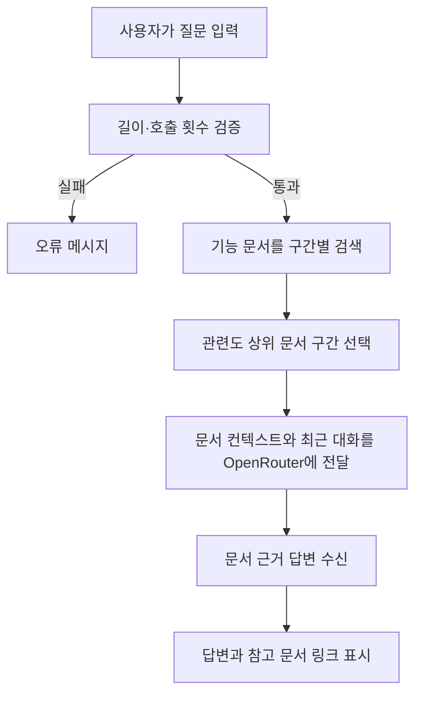

# 9. 기능 문서 RAG 챗봇

## 9.1 기능 설명

공개 웹페이지 오른쪽 아래의 버튼을 누르면 기능 안내 챗봇이 열린다. 질문을 받으면 서버가 `docs/*.md`에서 관련 구간을 검색하고, 선택된 문서 구간과 최근 대화만 OpenRouter 모델에 전달한다.

## 9.2 처리 순서도



## 9.3 기능명세

| 항목 | 내용 |
|---|---|
| 화면 | 공통 공개 페이지의 오른쪽 아래 플로팅 버튼과 대화 패널 |
| API | `POST /docs/chat` |
| 입력 | 질문 1~800자, 최근 대화 최대 6건 |
| 검색 | 제목·키워드·한글 접미사 정규화·문자 n-gram 점수 |
| 컨텍스트 | 관련도 상위 5개 구간, 최대 약 8,500자 |
| 답변 정책 | 기능 문서에 근거한 내용만 답변하고 근거가 없으면 확인 불가 안내 |
| 호출 제한 | IP별 분당 10회(애플리케이션 메모리 기준) |
| 대화 저장 | 브라우저 `sessionStorage`; 브라우저 세션 동안만 유지 |
| 화면 격리 | `body` 마지막의 `#ksee-chatbot-root` fixed portal 안에서만 패널과 버튼 렌더링 |

## 9.4 API 키 설정

로컬 `run-local.ps1` 실행 기준으로는 프로젝트 루트 `.env`의 아래 항목에 OpenRouter API 키를 입력한다.

```properties
OPENROUTER_API_KEY=sk-or-v1-여기에_API_KEY_입력
```

`.env`는 `.gitignore`에 포함되어 Git에 커밋되지 않는다. 서버는 환경변수와 `src/main/resources/openrouter.properties`를 모두 지원하며, 환경변수가 파일 설정보다 우선한다.

모델은 같은 파일의 `openrouter.model` 또는 배포 환경변수 `OPENROUTER_MODEL`로 변경할 수 있다. 기본값은 `openrouter/free`다.

## 9.5 보안 및 운영

- API 키는 서버에서만 사용하며 브라우저 응답이나 JavaScript에 포함하지 않는다.
- 질문과 최근 대화 길이를 제한한다.
- 모델에는 검색된 문서 구간만 참고 자료로 제공한다.
- 챗봇 root는 `position: fixed`, `contain: layout paint`, `isolation: isolate`로 일반 문서 흐름과 분리한다.
- 패널과 버튼은 챗봇 root 내부에서만 생성하며 홈·게시판 DOM의 클래스, 폭, 여백을 변경하지 않는다.
- 인스턴스가 여러 개인 운영 환경에서는 프록시/API Gateway 단의 공통 rate limit을 추가한다.
